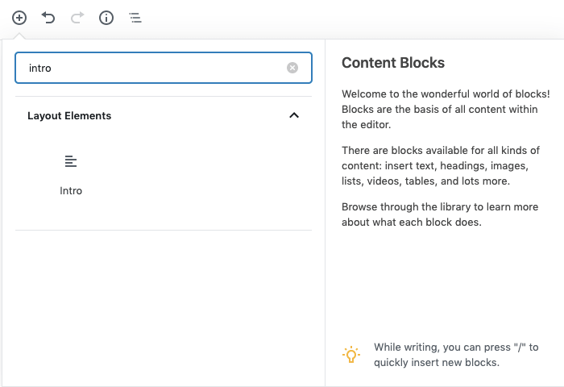

Roots sage should be a strong contender for building your custom WordPress themes, read more about this starter theme [here](https://roots.io/sage/).

Roots sage makes it remarkably easy to add custom Gutenberg blocks with ACF fields. By installing just two more additional composer packages, adding cheeky blade comment to each block view file and creating a controller file for each block, we’re all set. Below I’ve listed the initial commands to run in the terminal in the theme root and the code to add to the relevant theme files.

**Commands**
------------

```bash
composer require orditeck/sage9-acf-wp-blocks
```

Composer library that allows you create custom Gutenberg blocks with ACF fields. The original library was created by [MWDelaney](https://github.com/MWDelaney) but due to a slight issue use the above forked version for the time being.

```bash
composer require stoutlogic/acf-builder
```

Composer library that allows you to create your ACF fields via php as opposed to the WordPress ‘custom fields’ GUI. This library alone has saved a huge amount of development time for me. So, if you’re not interested in creating/using Gutenberg blocks but still use ACF, I strongly recommend you use this with Roots Sage.

Now we’ve installed both the composer packages lets move onto the code. For this example we’ll be adding an intro block, consisting of two ACF fields, a heading and a WYSIWYG.

Code
----

**app/fields/blocks/intro.php**

```php
<?php

namespace App;
use StoutLogic\AcfBuilder\FieldsBuilder;

$intro = new FieldsBuilder('intro');

$intro
    ->setLocation('block', '==', 'acf/intro');

$intro
    ->addText('heading')
    ->addWysiwyg('text');

return $intro;
```


**app/setup.php**

Include the StoutLogic namespace below the other namespaces included at the top of this file.

```php
<?php

namespace App;

use Roots\Sage\Container;
use Roots\Sage\Assets\JsonManifest;
use Roots\Sage\Template\Blade;
use Roots\Sage\Template\BladeProvider;

// Add it here
use StoutLogic\AcfBuilder\FieldsBuilder;
```  

On the same file, add this snippet inside the **after\_setup\_theme** add\_action. It should be at the bottom.

```php
/**
* Initialize ACF Builder
*/
add_action('init', function () {
  if (function_exists('acf_add_local_field_group')) {
      // Gutenberg blocks
      collect(glob(config('theme.dir') . '/app/fields/blocks/*.php'))->map(function ($field) {
          return require_once($field);
      })->map(function ($field) {
          if ($field instanceof FieldsBuilder) {
              acf_add_local_field_group($field->build());
          }
      });
  }
});
```

**resources/views/blocks/intro.php**

```php
{{--
  Title: Intro
  Description: Introduciton Text
  Category: layout
  Icon: editor-alignleft
  Keywords: intro introduction text
  Mode: edit
  Align: left
  PostTypes: page
  SupportsAlign: left right
  SupportsMode: false
  SupportsMultiple: true
--}}

<section class="intro mb4 mb5-ns">
  <div class="mw8 center ph3 cf">
    <div class="fl w-100 w-70-ns">
      @if(get_field('heading'))
        <div>
          <h1>
            {{ the_field('heading', 'options') }}
          </h1>
        </div>
      @endif
      @if(get_field('text'))
        <div>
          {!! get_field('text') !!}
        </div>
      @endif
    </div>
  </div>
</section>
```

Once you’ve added the above, ensure you’re in your theme root and run **yarn build && yarn start** in your terminal, go to your WordPress backend and edit your pages or posts and notice there’s an extra **layout block** named **intro** that you can add via the block editor.


