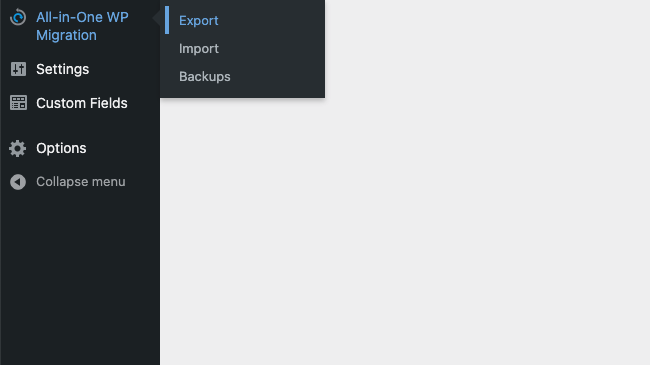
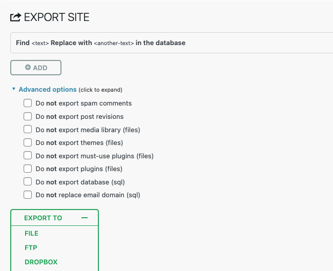
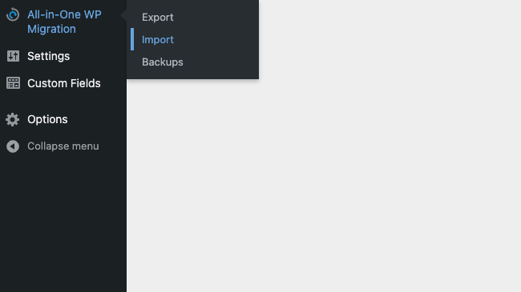
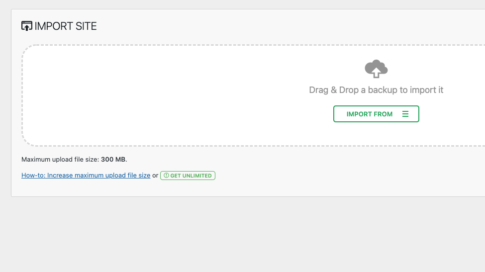
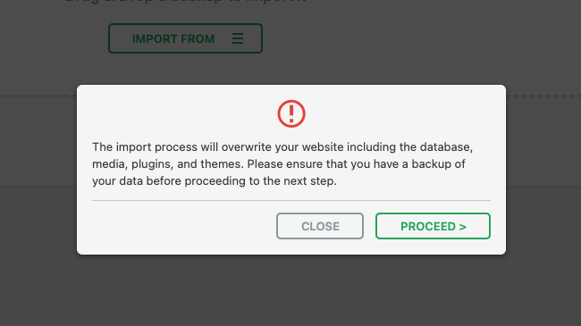

Migrating a WordPress website can be a daunting task. Recently I managed to migrate an 18 GB WordPress website to a staging server, in order to test a new theme I was building for a client. Although the process with quite slow, given the size, it flawlessly cloned everything. 

Of course there's a plethora of ways to accomplish this, FTP being the simplest, but my weapon of choice is the [All-in-one wp migration](https://wordpress.org/plugins/all-in-one-wp-migration/) plugin by [Servmask](https://servmask.com/). The free version allows you to migrate a website up to a size of 512 MBs and the unlimited version, only $69, allows unlimited MBs.

## Exporting

Migrating with this plugin is remarkably simple. Firstly, head to the WordPress website you'd to export. Once there, install and activate the [All-in-one wp migration](https://wordpress.org/plugins/all-in-one-wp-migration/) plugin then navigate to the export edit screen as demonstrated below:

Once clicked, you should be greeted with a screen that enables you to execute a search and replace on the database and the ability to exclude certain parts of the website on export (neither is required). For simplicity, we'll export to a File by clicking the green **EXPORT TO** button then the **FILE** option. This should prompt you with an animating download button, click it:

## Importing

Next, once downloaded, switch to the website you'll be migrating to, install and activate the [All-in-one wp migration](https://wordpress.org/plugins/all-in-one-wp-migration/) plugin once more and navigate to the import edit screen:

Here you'll be able to drag and drop the export file you previously downloaded. Alternatively, click **IMPORT FROM** then **FILE** to select the file manually on your computer:

**Note:** The maximun upload file size depends on your server configuration. To extend it to 512mb simply download, install and activate the free [All-in-One WP Migration Import](https://import.wp-migration.com/) plugin.

Moving on, once you've uploaded the import file, let All-in-one do its thing. Sooner or later, depending on the size the import, it'll prompt you to proceed:

**Note:** once you click this button, it'll override all existing data on the website you're importing into.

Finally, after the import has completed it'll present a final **Finish** button which finalizes the process. What's more, as you're importing an entirely different website WordPress, when trying to visit anywhere on your dashboard now it'll ask you to log in. Don't panic, this'll be the login details from the website you're importing. I also recommend you to refresh your permalinks via settings -> permalinks then clicking the **Save changes** button located at the bottom of the page.

## Conclusion

Let's be honest, migrating a live site can be frustrating. I'm sure there's a much more efficient technical method these days but if you like to keep things simple and intuitive, All-in-one might be for you. Moreover, when migrating the 18 GB website I mentioned earlier, my upload speed was ~10mb and it took about 5 hours. I basically glued my laptop to the router and routinely checked on it, but it worked.