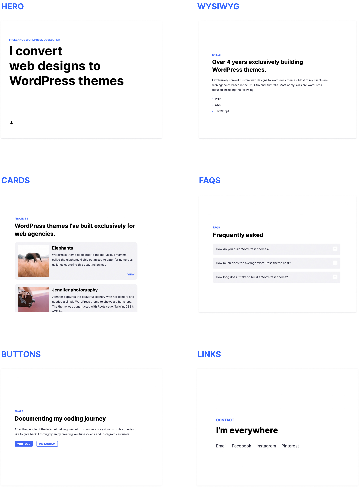
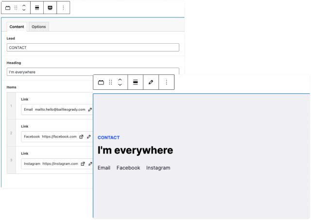
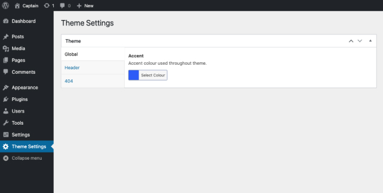
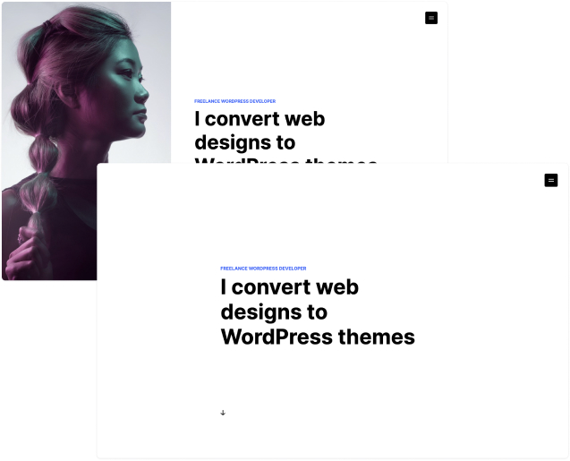
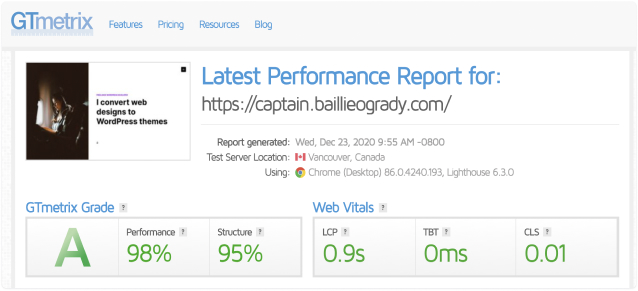

## Captain is a minimal WordPress theme I exclusively designed and developed for Gutenberg.

The primary goal for this theme was to keep things simple, utilising negative space to lay empathsis on the content. Despite the Gutenberg editor still being quite fresh, producing custom Gutenberg blocks was effortless with ACF Pro.

In total this theme features 7 custom Gutenberg blocks, including a spacer block, built to seamlessly blend in with any other block, native or third party. Each block, as pictured below, has both a content and options tab to enable full flexibility. 

### Mirror image previewing

A massive selling point to using Gutenberg is the ability to produce mirror image previewing in the Gutenberg editor. So all the most common and abundant native blocks like heading, paragraph and list, are all styled by default to match the styleguide of the theme. Therefore, gone are the days of visiting an external preview page of your page / post, the exact results are presented to you as you edit.

### Inuitive global settings

For the global settings I decided to use ACF options to keep the editing as intuitive to WordPress as possible. Here you are able to alter the accent colour that runs throughout the theme, mobile menu business name and the 404 page’s content.

### Two layout options

For the layout I decided to once again, keeps things minimal. If there’s a featured image uploaded for the post / page it’ll appear to left and stay fixed as you scroll with your Gutenberg content aligned to the right. If no featured image is selected, being the default, the Gutenberg content will align to the center.

### Optimised for fast speed

Lastly, I’d like to talk about speed. With the theme being quite minimal, page load seed was’nt much of an issue. I converted the fonts to base64 and integrating them into the CSS, to save on https requests. I also implemented lazy loading on the images, so they only apper as the user scroll to them on the page. The results below speak for themselves but aquiring a pre 1 second page load time was paramount to me, faster the better.

