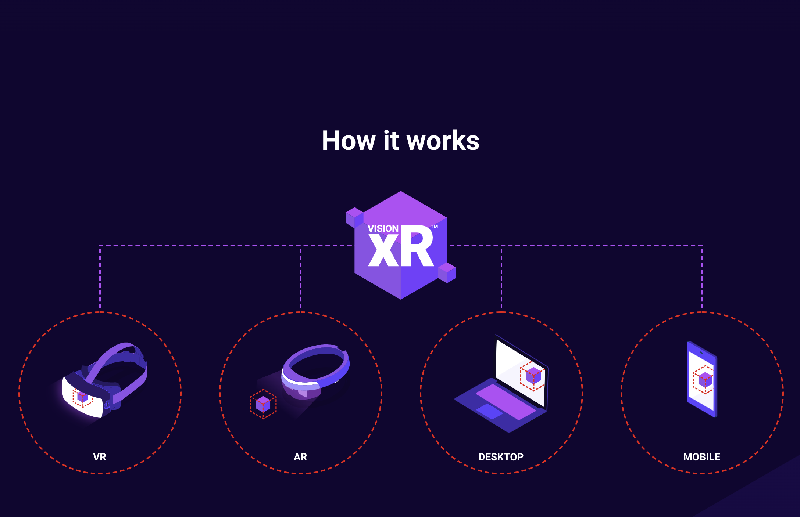

Future visual is a VR & AR studio based in Brighton, UK. After already having their web designs finalised, they needed someone transform them into a fully functional, optimised WordPress website in just 2 weeks. During this project I had the chance to work with a brand new WordPress starter theme, wprig, which influenced me to transition from Sass to PostCSS.

Despite the really short deadline, I explained to them my background working with very fast paced agencies and completed the whole website in less then two weeks with time left over to optimise and achieve a fast page load times.

The most time consuming part of the project was building the [VISIONXR](https://www.futurevisual.com/visionxr/) page. I remember trying to match the designs exactly for the 'How it works' section.

After hours of playing around with dotted borders, widths for each icon and then completely transforming layout for mobile, I finally accomplished the fully customisable icon section they really wanted.