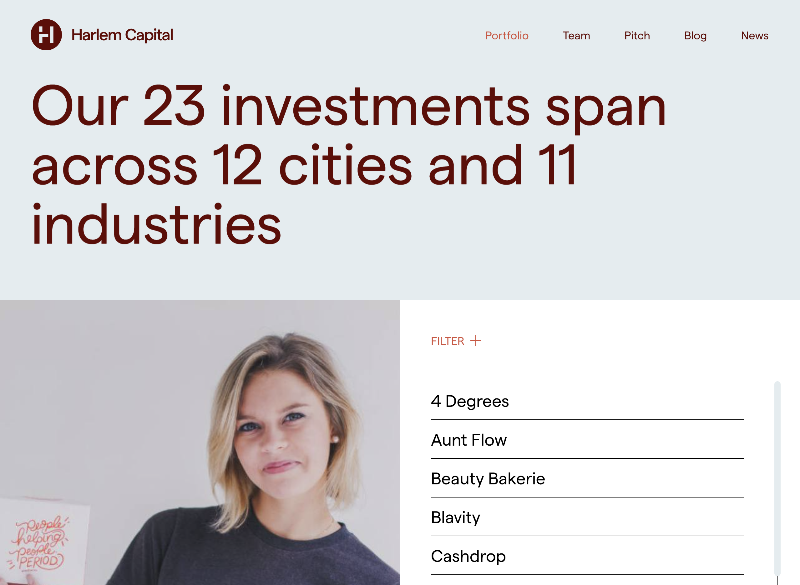

Harlem Capital is a New York based early-stage venture capital firm focused on investing in minority and women founders in the United States. To further highlight their mission they issued a complete redesign of their website. The web designs were built and given to me in Figma and I had two weeks to convert them to the fully functional WordPress website that's live today.

A key highlight was building the portfolio and team archives. They're both native WordPress archive pages with embedded React applications to smoothly navigate and load to their single pages. For instance, when visiting the portfoio page (pictured below) you'll notice a list of links. Clicking one of these animates and loads in the single page's content via React router, avoiding the default page refresh and providing a smooth UX. What's more, the '+FILTER' functionality is also controlled by React using React Hooks.

